= Bitmap Documentation
Nikita Mortuzaiev <mortunik@fit.cvut.cz>

[.lead]
*This is the documentation to the bitmap task for the BI-MGA subject at FIT CTU authored by Nikita Mortuzaiev.*

//Showing all the source images for the first result and where I got them
== The source photos for this work are:

 - The source view of the first photo: view_1.jpg

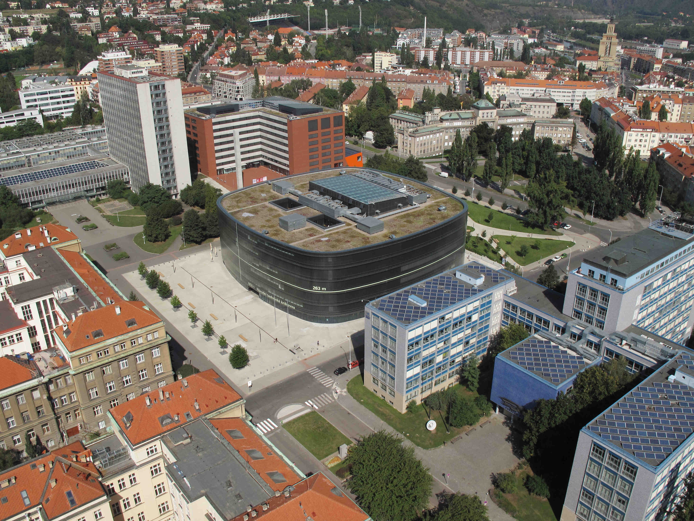
[.small]#Source: Google Images#

 - The source photo of myself made in the respirium at the 10-th floor in A-building

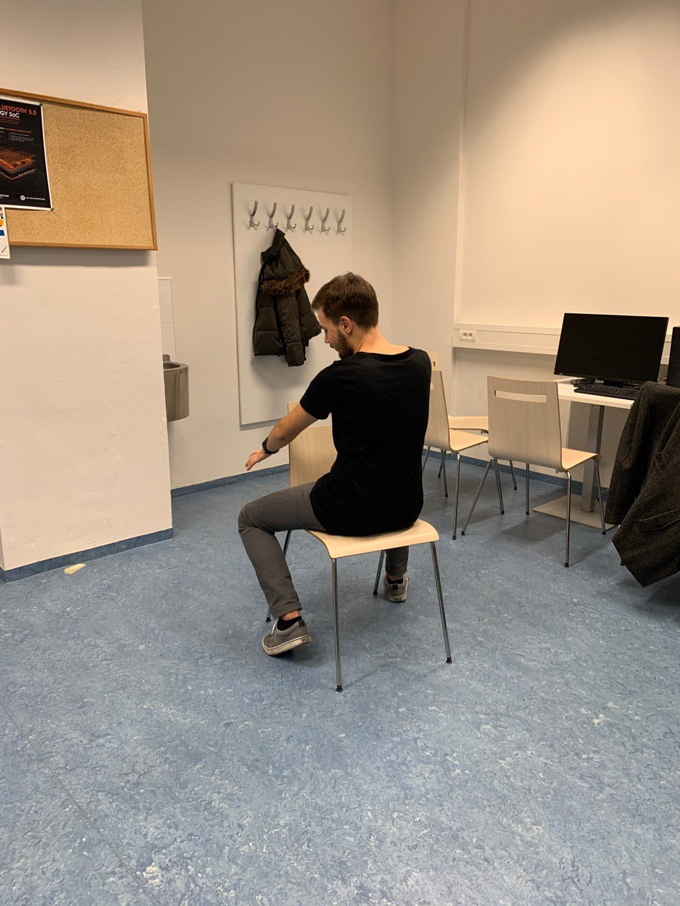
[.small]#Photographed by: Maria Kolesova#

 - My transport - NASA space shuttle: shuttle.jpg 

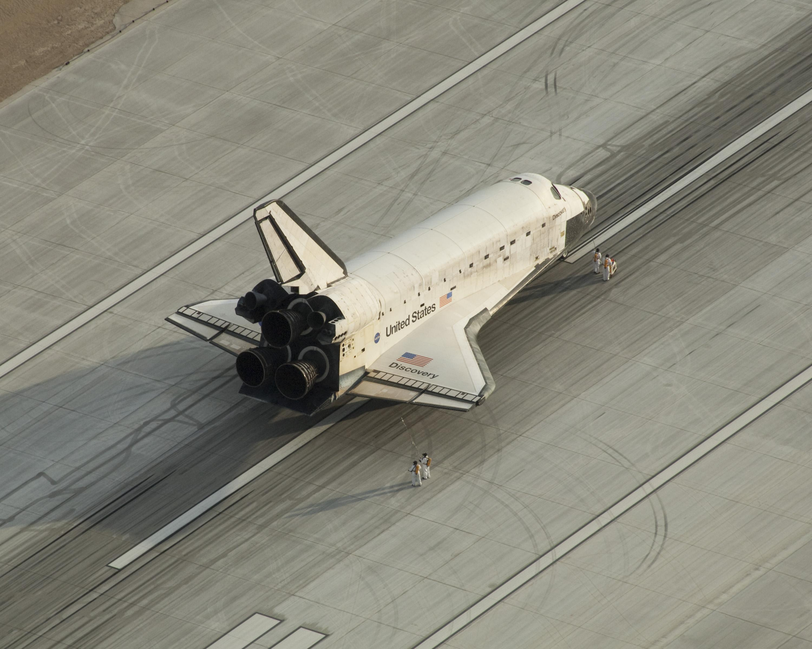
[.small]#Source: Google Images#
 
 - The bridle: bridle.jpg

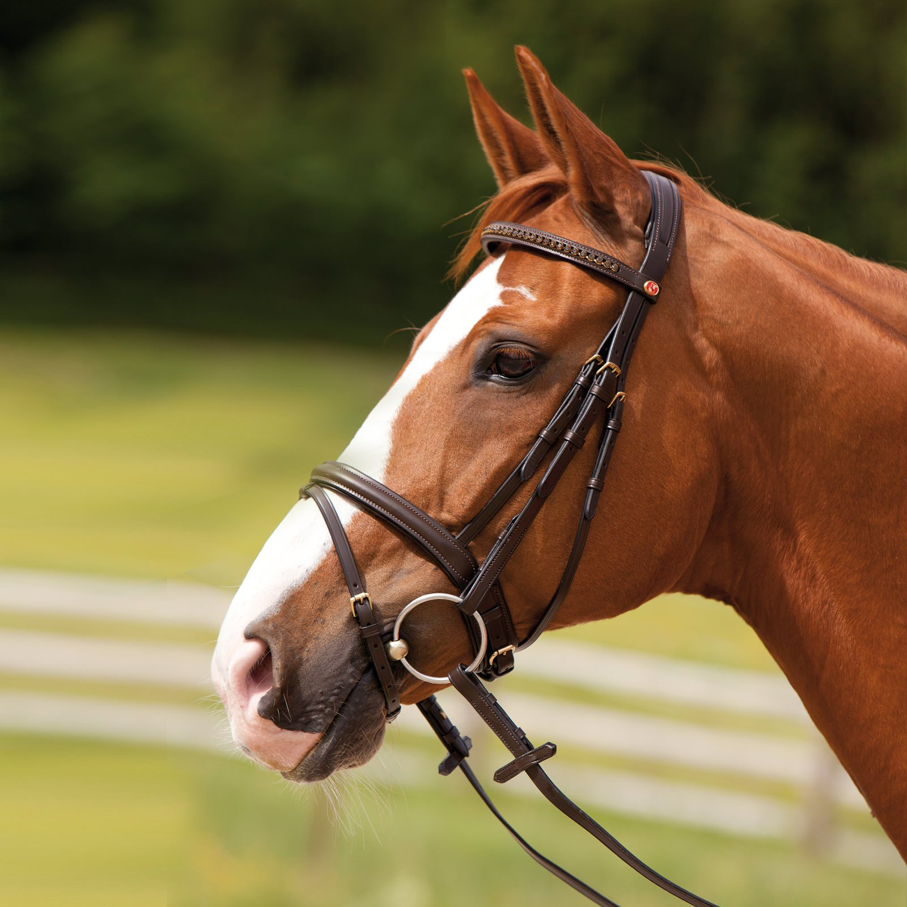
[.small]#Source: Google Images#

 - The seat: seat.jpg

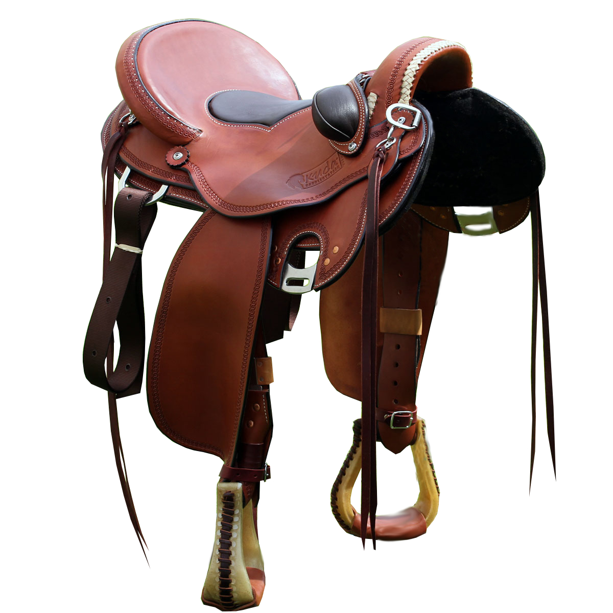
[.small]#Source: Google Images#

 - Rocket fire: fire.png

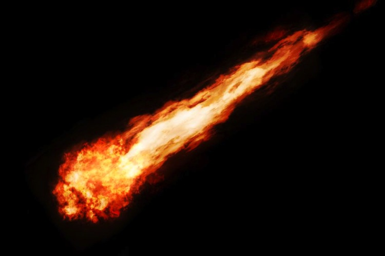
[.small]#Source: Google Images#

//Describing the process of creating the result image
== Steps:

1) Firstly, I roughly cut the shuttle off of the source picture and pasted it to the new layer. Then I flipped it 
horisontally and slightly modified the perspective, so it looks more natural. Finally, I used the layer mask tool to hide roughly 
cutted parts of the rocket and make the edges look better. 

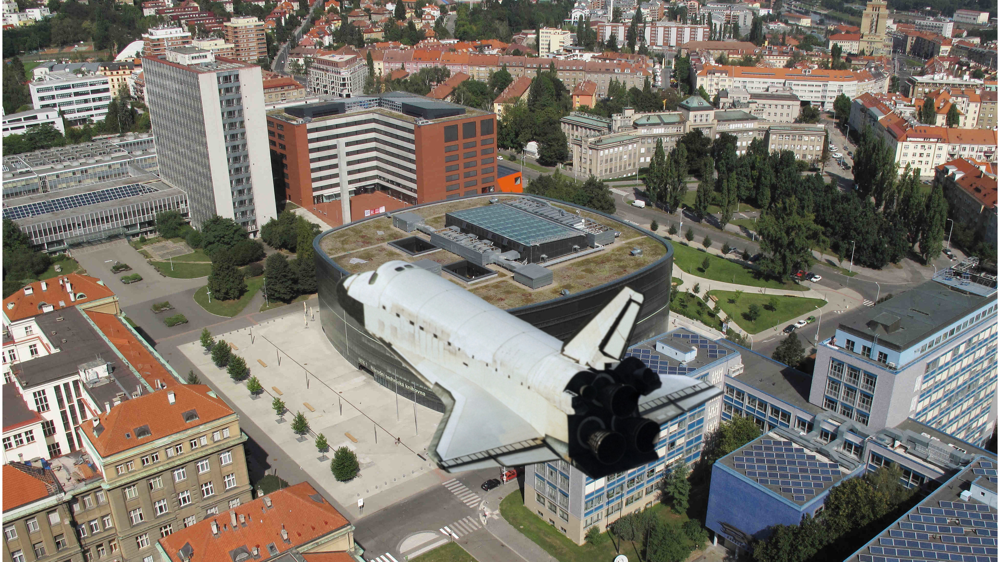

2) For the second step, I used the same technique as for the shuttle to paste the image of myself to another layer (higher than the 
rocket layer).

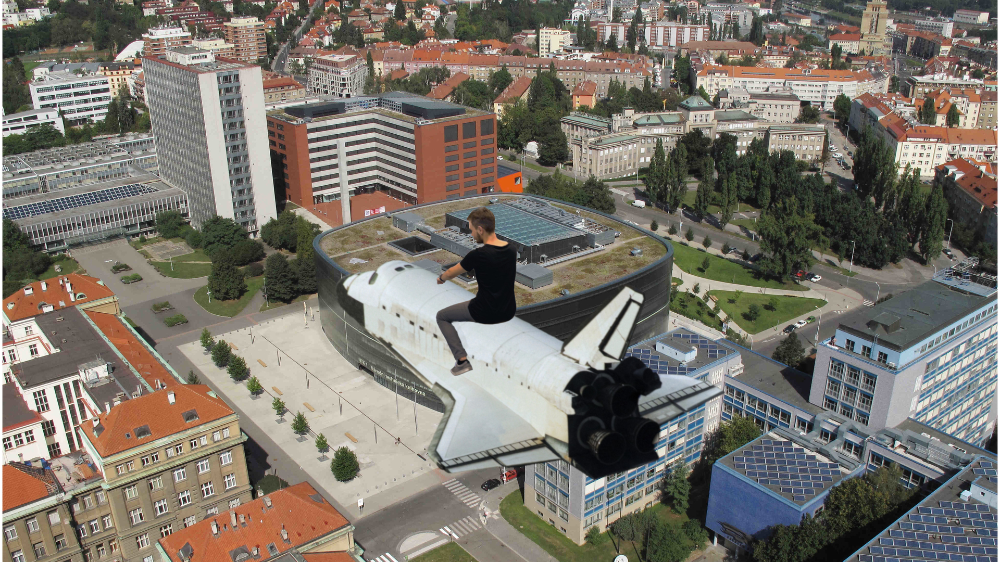

3) To add some rocket fire, I used the "mulpiply" and "addition" modes of the layer. Then I combined some duplicates of it and 
played with Hue/Saturation and Curves to make it look the most natural.

4) For the fourth step, I pasted the seat and the bridle (using the same technique with mask) and used the perspective tool to 
adjust them. I also added motion blur to the seat and some shadow to the bridle.

5) Here I continued to play with motion blur and added it to the shuttle and myself.

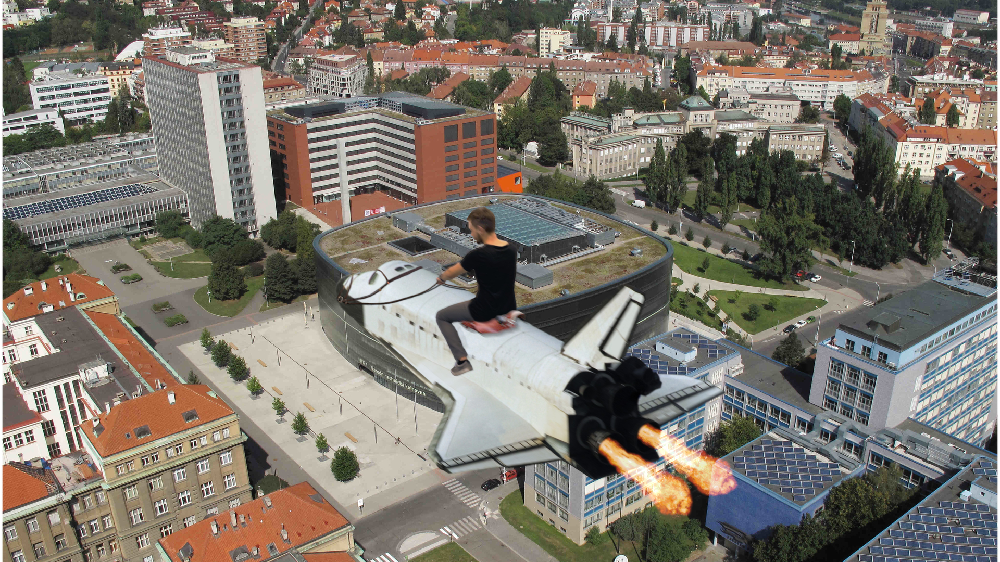

6) Then, I added a new layer with "multiply" mode to create some visual effects (like shadows and lighting) and simply drew them 
using the brush tool. 

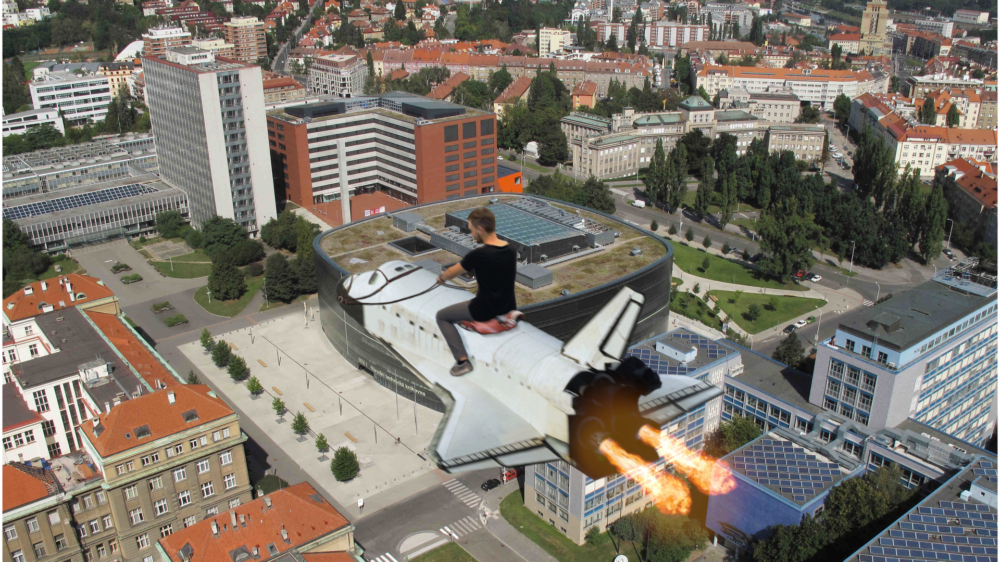

7) Last, but not least, I used a text tool to create the text and hid an "easter egg".

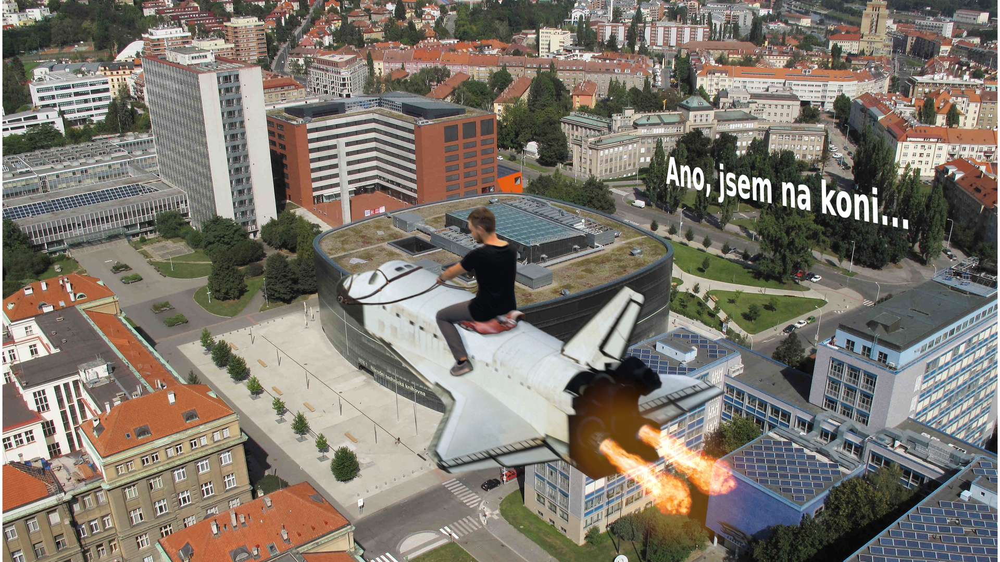

//Writing all the tools and filters I used
=== So, as it can be seen from the steps above, I used the tools and filters, such as:

 - Layer mask tool (plus brush and eraser tools to mask or show needed parts of the layer);
 - Layer modes and opacity ("Normal", "Addition", "Multiply" etc.);
 - Perspective, shear, scale, rotate, flip and other transform tools;
 - Brush, Eraser and Stamp tools to draw some details that could not be created in other way;
 - Hue/Saturation, Brightness/Contrast, Image Temperature, Curves, Color Balance tools; 
 - Linear motion blur and Gaussian blur;
 - Add Shadow and Light Effects filters;
 - Noise filter;
 - Text tool;
 - Zoom and Color Picker tools.

== The results of my work:

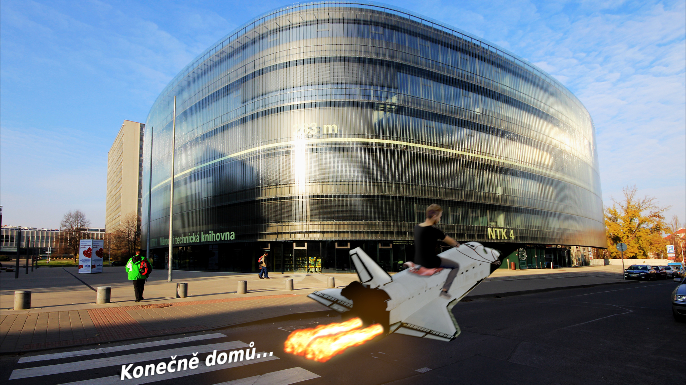

== Summary:

_I spent around 8 hours on the first image and around 3 hours on the second one. I learnt a lot of techniques useful for the photo 
editing._
