= Vector Documentation
Nikita Mortuzaiev <mortunik@fit.cvut.cz>

[.lead]
*This is the documentation to the vector task for the BI-MGA subject at FIT CTU authored by Nikita Mortuzaiev.*

//Showing all the source images for all the results and where I got them
== The source photos for this work are:

 - The source photo for the first vectorization: vector_src.jpg

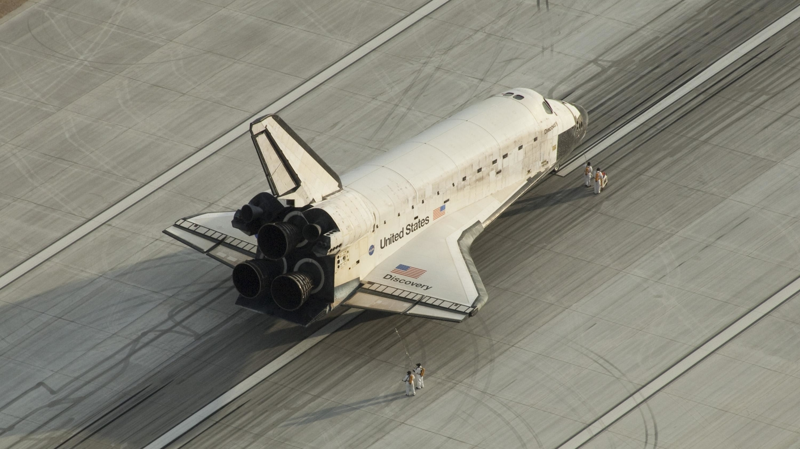

[.small]#Source: Google Images.#

 - The source photo for the second vectorization: vector_2_src.jpg

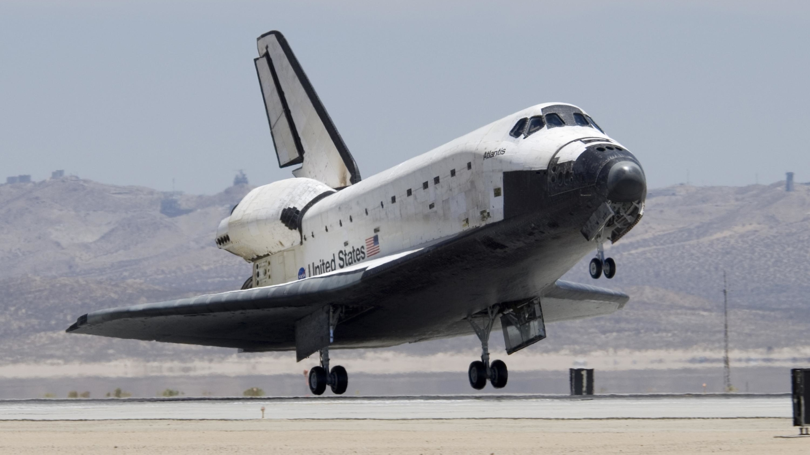

[.small]#Source: Google Images.#

 - The source photo for the automatic vectorization: automatic_src.jpg

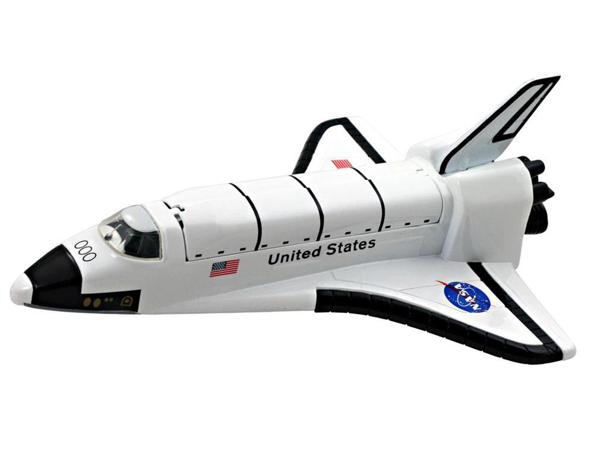

[.small]#Source: Google Images.#

//Describing the process of creating the first image
== Steps for the "border" method:

1) To start off, I used a "Draw Bezier curves and straight lines" tool to create a full shape of a space shuttle. I filled it with 
the color I liked and changed the opacity of its layer to be able to see the bitmap background underneath and draw another shapes. 
Then I drew another shape to divide a shuttle wing from its other part and changed the color of it. I played a lot with the points 
this tool created (using the "Edit paths by nodes" tool), changing some of them to the smooth points and leaving anothers with the 
sharp corners. I was also able to move them to create the precise needed shape. I made the borders of the main shape the most thick 
and decided to made them thinner for the smaller parts and the most thin for the smallest details that I created later.

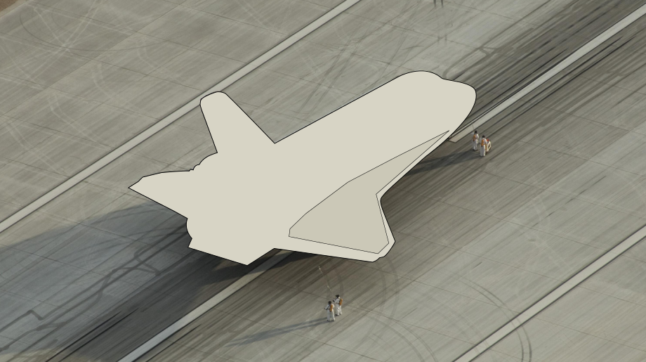

2) Then I added some black and gray parts to divide a back part and the parts that are shaded on the source image. I tried to save 
all the details of it in my new shapes and also spent a lot of time playing with it. To get the right color for the shape I used the 
"Color picker" tool and made the layers with the shapes invisible (the "Eye" button near the layer) to be able to pick a color from 
the background.

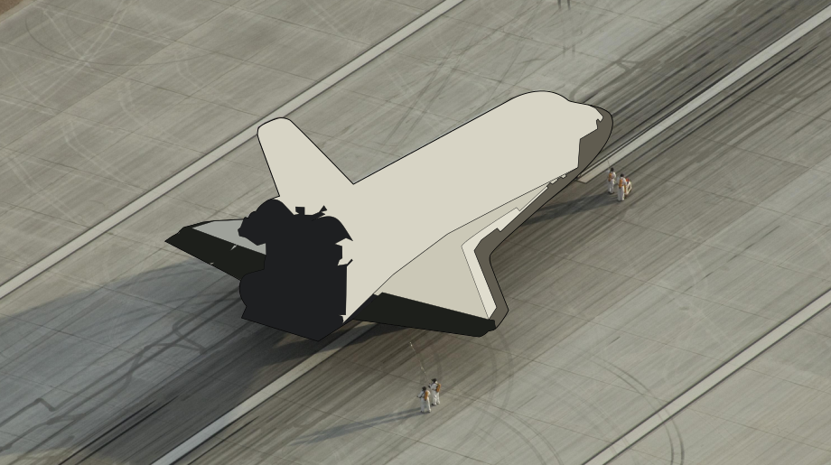

3) At this point I decided to start detalizing the back part of my transport and entirely moved the black shape to a new layer. Here 
I used the "Create circles, ellipses and arcs" tool to draw the engines of my shuttle and used the same technique (making the 
layers invisible) to pick the right color for them. I also used the "Create Bezier curves" tool to create some other details.

4) Here I added those circles behind the engines and added the black parts to make an upper wing look like at the source image. I 
also added some shapes in different colors to create more details and emphasize the other parts. I used the "Create Bezier curves" 
everywhere.

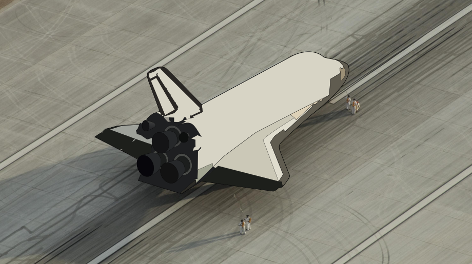

5) Then I fully detalized the wings and used the "Create rectangles and squares" tool to create a needed tile and then tranformed it 
using the "Select and transform objects" tool. I copied one tile and pasted it many times to create all the pattern that you can see 
on the image below. "Edit paths by nodes" tool also helped me a lot.

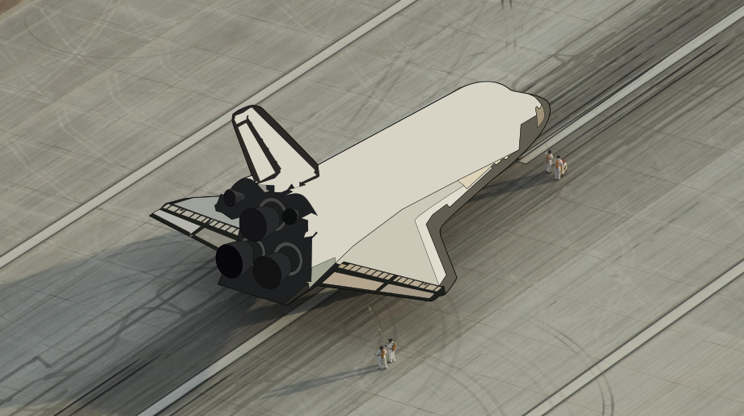

6) Now I tried to create something special and used the "Create and edit text objects" and "Select and transform objects" tools to 
create the "United States" text on the shuttle. I also created the most detalized object in my work - the USA flag that finally 
looked very well. I would have been helpless without a "Zoom in or out" tool that obviously made a colossal work here.

7) Continuing to play with small details, I created the ellipse and copied it many times to make a good looking pattern of holes on 
my shuttle. I also added some thin lines to visually divide it into some good-looking parts and make it look even more detalized.

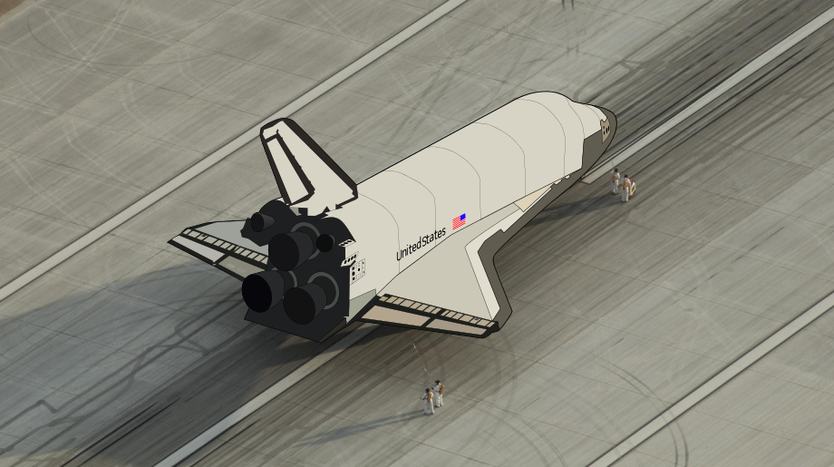

8) Finally, there were one thing left to make - the windows and other rectangle details. I made them using the same tools as for the 
wings pattern and transformed every one of them to make them fit as on the backgroung image. The front windows were created with the 
"Create Bezier curves" tool and filled with the good color with the help of the "Color picker" tool.

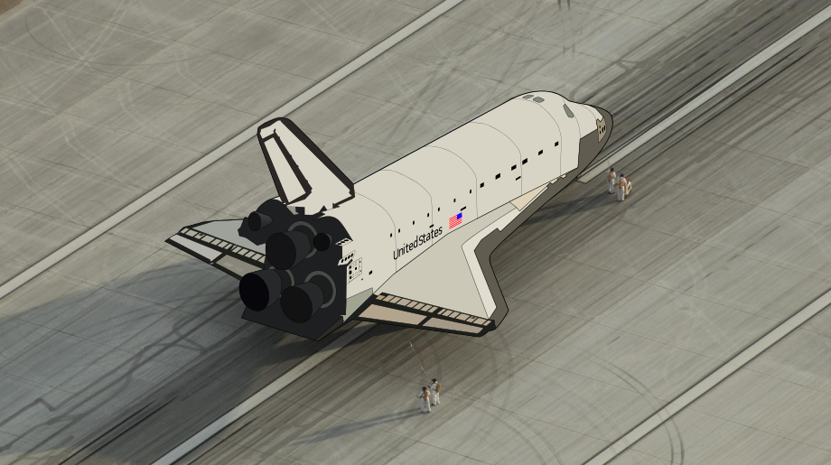

//Describing the process of creating the second image
== Describing the "overlap" method:

 - The "overlap" method itself means creating the vectorized image by overlapping the bitmap image with the primitive forms such as 
circles and rectangles and then reshape, transform and combine them to create perfect needed shapes. To be honest, I tried to apply 
this method on my space shuttle, but there are so many irregular forms and curves, so that I used a lot of the opposite "border" 
technique that I described before. Here is the result:

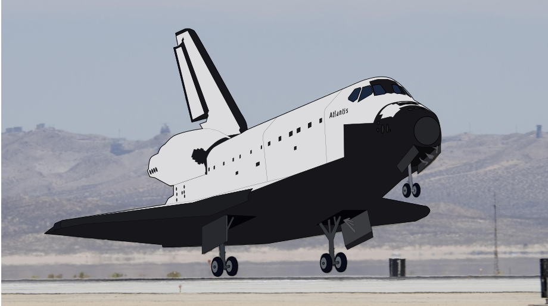

//Describing the automatic vectorization
== Describing the automatic method:

 - The possibility of vectorizing an image automatically is very satysfying. I tried to do it with the right settings, but finally 
it obviously looks less cool than the manually created images. I found the image with the white background and not so many different 
colors to make the result look better. Here is the result:

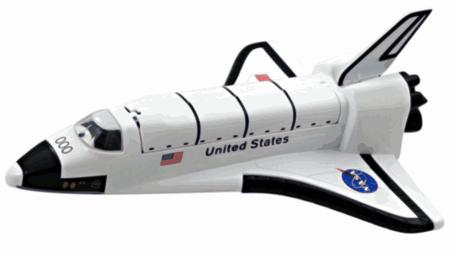

//Writing all the tools and filters I used
=== So, as it can be seen from the steps above, I used the tools and instruments, such as:

 - "Create Bezier curves and straight lines" tool to create irregular shapes.
 - "Color picker" tool to choose the right color for the shapes.
 - "Edit paths by nodes" tool to make my shapes fit to the forms of the source image and to make some of them smooth.
 - "Select and transform objects" tool to select and transform objects... hmmm...
 - "Create circles, ellipses and arcs" and "Create rectangles and squares" tools to create some circles and rectangles.
 - "Eye" and "Lock" buttons near the layers to hide or lock them (helps a lot).
 - Opacity of the layer to be able to see the backgroung through it.
 - Path -> Trace Bitmap option to create an automatic vectorization.
 - "Zoom in or out" tool or hotkeys Ctrl + Mouse wheel to zoom the image.
 - Some other stuff like Layer -> Layers... or Object -> Fill and stroke... options to show the handful panels.

== The results of my work:

== Summary:

_I spent around 5 hours for the first image and around 3 hours for the second one. I learnt three techniques to vectorize an image: 
"border" method, "overlap" method and automatic method._
