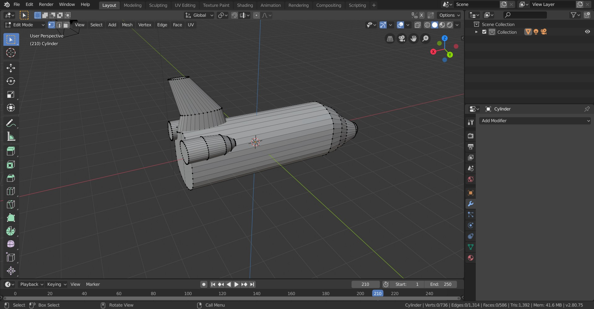
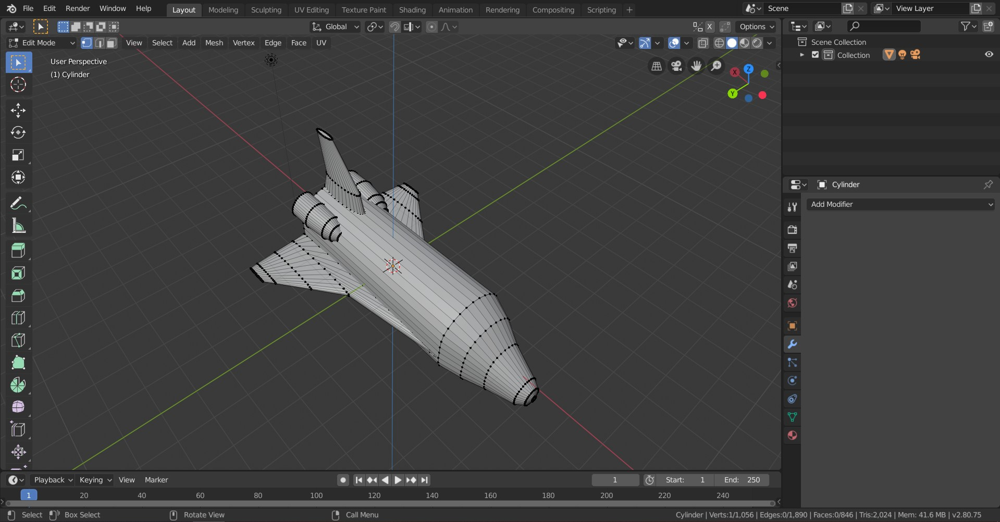
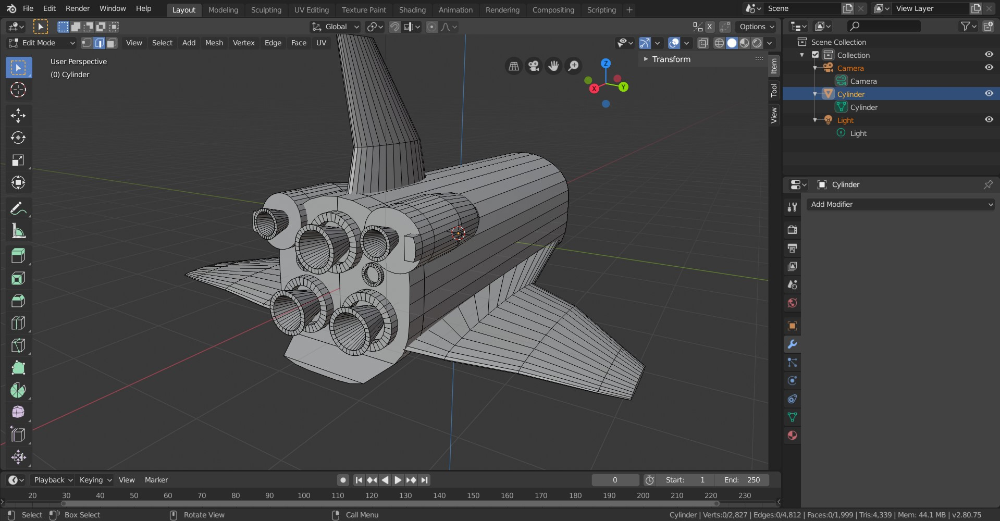
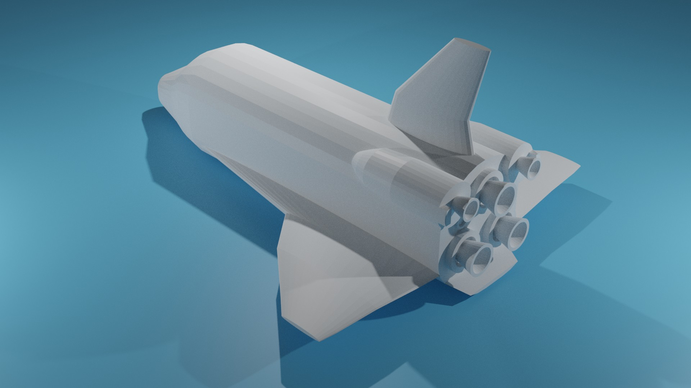
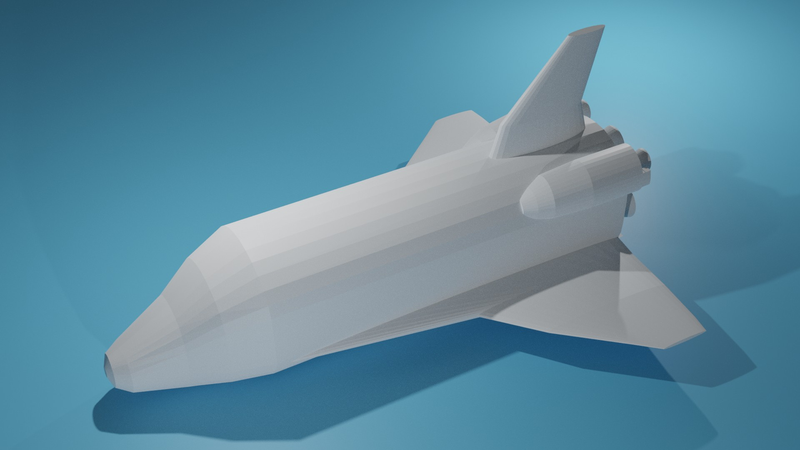

= 3D Documentation
Nikita Mortuzaiev <mortunik@fit.cvut.cz>

[.lead]
*This is the documentation to the 3d task for the BI-MGA subject at FIT CTU authored by Nikita Mortuzaiev.*

//Showing all the source images for the first result and where I got them

//Describing the process of creating the result image
== Steps:

1) I started off with creating a simple cylinder and reshaping it into somithing more or less similar to the NASA Rocket. I also 
played a lot with the shapes and vertices.

2) Then I created rocket wings and adjusted them to my form.

3) Here I plaued a lot with the rocket exhausts. I started by creating a simple circle and then extruded and reshaped it to created 
a needed parts. I also used symmetrize function.

4) Finally, I created a plane and painted it and the rocket itself. Then a rendered the image using the Cycles machine. Here is a 
result:

//Writing all the tools and filters I used
=== So, as it can be seen from the steps above, I used the tools and filters, such as:

 - Add mesh tool, Grab, Scale and Rotate tools.
 - Extrude and Bevel tools.
 - Symmetrize tool.
 - Object and Edit mode. Rendering.
 - Add Material tools and painting.
 - Some modifiers.

== The results of my work:

== Summary:

_I spent around 5 hours on this model. I learnt a lot of techniques useful for the 3d modelling. Now I am not a complete beginner 
in Blender and I can create some simple models for my future projects._
